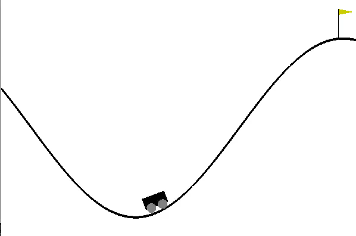

# Evolutionary RL, Practical session 4

In this practical, you are asked to put what you just learnt
about direct policy search. You are provided with the `main.py` file. Use `python main.py -h` to check how you are supposed to use this file.

In this project, you are asked to solve the classic Mountain Car (https://gym.openai.com/envs/MountainCar-v0/). For more details about action and observation space, please refer to the OpenAI
documentation here: https://github.com/openai/gym/wiki/MountainCar-v0

## How do I proceed ?
As previous pratice, the baseline (RandomAgent) is provided as a starting kit.   It
contains several files, two of them are of interest for you:
agent.py and main.py .agent.py is the file in which you will write the code of your agent,  using
the RandomAgent class as a template.  Don’t forget to read the documentation
it contains.  As usual you can have the code of your several
agents in the same file, and use the final line `Agent = MyAgent` to choose which agent you want to run.

You are expected to implement direct policy search algorithm using evolutionary computation (CMA-ES).
The running of your agent follows a general procedure:
1. Train your agent using CMA-ES in `train` method
2. Test and score your final agent using `act` method

We are in the setting of model free approach (Pg 10. https://www.lri.fr/~sebag/Slides/RL_DPS.pdf).

In order to efficienlty train your agent, you must (ref. pg 42 of Michèle's slides):
* Define your search space (policy space in which your are willing to search for)
* Define your objective function: to assess a policy (Episode-based or step based)
* Optimize the objective using cma-es: use https://pypi.org/project/cma/ Be aware that we setup a time budget of 2hr in Codalab. You can always start doing local train then initialize your agent with good values for Codalab submission.

## Challenge your friends
You are required to have a codalab account (https://codalab.lri.fr).
Please use an username in the format of *firstname.lastname* when creating your account.
You can enter to the competition here https://codalab.lri.fr/competitions/374

For submission, you need to zip `agent.py` and `metadata` files then submit the zipped file to codalab.
`baseline.zip` as an example of submission.

If you want to reproduce your local score on Codalab, please use the docker image (https://cloud.docker.com/u/herilalaina/repository/docker/herilalaina/rlaic) and do not change the seed.
Then run `python main.py --ngames 500 --niter 200 --batch 10`

For further questions, please use the codalab forum.

## Grading
* 3/4: Agent implementation
* 1/4: rank on the competition

Deadline: 28/01/2019

Only the last submission is considered for grading (agent implementation) and ranking (challenge).
